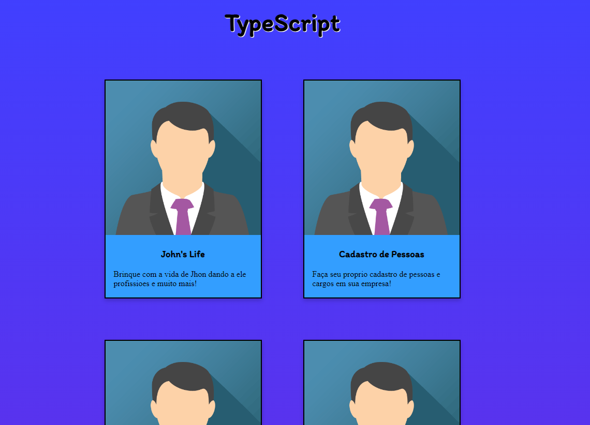
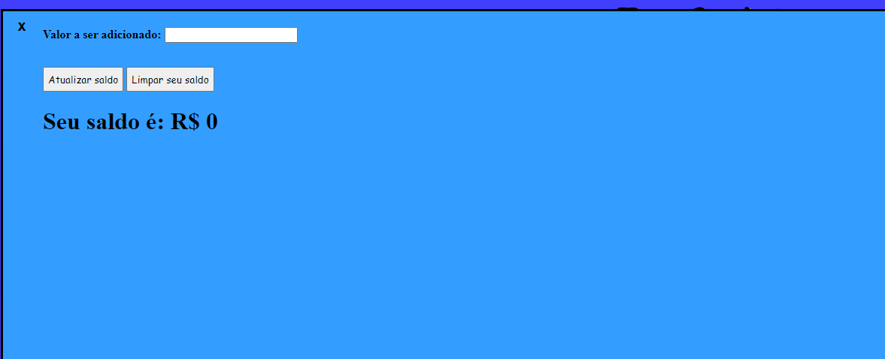

# DIO - Typescript 

- este projeto compõe desafios proprosto pelo professor, do curso "
Introdução Prática ao TypeScript", João Santos (https://github.com/lira1705/mentoria-typescript/tree/main/src/desafios). O desafio foi proposto pelo professor para testar as capacidades de compreendimento d aluno na linguagem.

### O cada desafio tem sua propria aba e função feita na linguagem typescript, tendo leitura de formulário, impressão de tela, atualização de dados, manipulação de Arrays e variaveis, dentre outras.

- obs: o desafio 4 foi resolvido e eledevolve uma lista de nomes de filmes para o usuario ver

